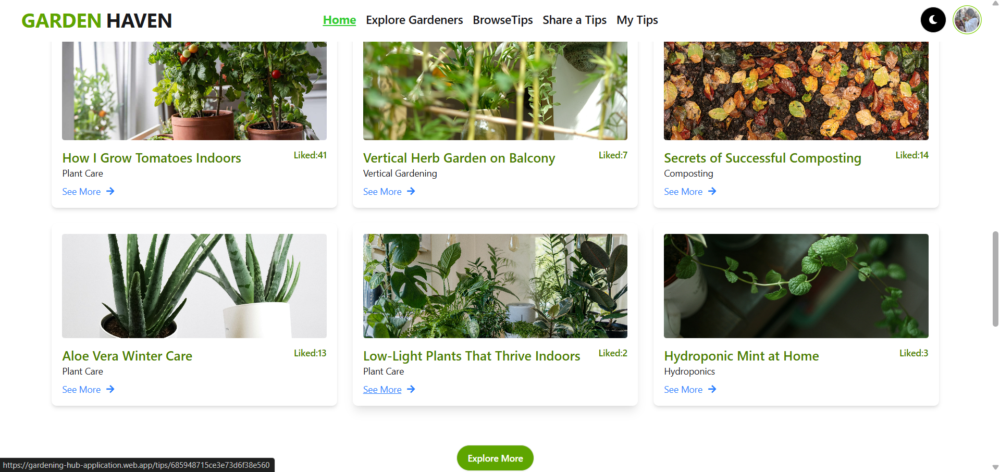

# 👋 Hello, I'm Chaitey
### Junior Frontend Developer (MERN Stack) | React Enthusiast


## 🚀 About Me
I'm an enthusiastic Junior Frontend Developer specializing in MERN stack, with strong foundation in React.js and modern JavaScript. I'm passionate about creating responsive, user-friendly web applications and continuously learning new technologies to enhance my skills.

## 💼 Current Activities
- 🔭 I'm working on **React Projects** and building my portfolio
- 🌱 I'm currently learning **Advanced React, Node.js, and MongoDB**
- 👯 I'm looking to collaborate on **Frontend Projects**
- 🤔 I'm seeking **internship/junior developer opportunities**
- 💬 Ask me about **React, JavaScript, HTML, CSS**

## 🛠️ Tech Stack

<p align="center">
  
  
  
  
  
  
  
  
  
  
  
  
  
  
</p>

## 📊 GitHub Stats


## 📈 Current Learning Path

```javascript
const currentSkills = {
  languages: ['JavaScript', 'HTML5', 'CSS3'],
  frameworks: ['React', 'Express.js', 'Node.js'],
  styling: ['TailwindCSS', 'DaisyUI'],
  tools: ['Vite', 'Firebase', 'Netlify', 'Vercel'],
  databases: ['MongoDB'],
  currentlyLearning: ['Redux', 'TypeScript', 'REST APIs']
};
```

🌐 Connect With Me
<p align="center"> <a href="mailto:chaiteychaitey30@gmail.com" target="_blank">  </a> <a href="https://github.com/chaitey23"target="_blank">  </a>   <a href="https://www.linkedin.com/in/jannatul-ferdouse-chaiteey/" target="_blank"> 
     
  </a> </p><p align="center"> <strong>📧 Email:</strong> chaiteychaitey30@gmail.com<br/> <strong>📍 Location:</strong> Dhaka, Bangladesh </p>

  ## 📌 Pinned Projects
Here are some of my key projects showcasing my skills and work:
### 1. Newspaper FullStack Website 📰
**Description:** Full-stack newspaper website with admin panel and subscription features, allowing users to read articles, view trending news, and manage subscriptions.

**Live Project:** [View Live](https://newspaper-fullstack-webs-53e81.web.app/)

**Screenshot:**


**Technologies Used:** React, Node.js, Express, MongoDB, TailwindCSS, Firebase

**Core Features:**
- User authentication via Firebase (email & Google login)
- CRUD operations for articles (admin)
- Trending articles section
- Subscription system with expiry check
- Charts and counters using react-google-charts & react-countup
- Responsive design for desktop, tablet, mobile

**Dependencies:**
- axios, react-router-dom, react-toastify, react-hook-form, firebase

**Run Locally:**
```bash
git clone https://github.com/chaitey23/newspaper-fullstack.git
cd newspaper-fullstack
npm install
npm run dev
```
### 2. Library Management System 📚
**Description:** Full-stack library management system for borrowing and returning books, managing categories, and tracking users’ borrowed books.

**Live Project:** [View Live](https://library-management-31a51.web.app/)

**Screenshot:**


**Technologies Used:** React, Node.js, Express, MongoDB, TailwindCSS, Firebase

**Core Features:**
- User authentication (Firebase email & Google login)
- Borrow & return books
- Book categorization
- Private routes for admin functionalities
- Responsive design for desktop, tablet, and mobile
- Real-time updates for book quantity and borrowed books

**Dependencies:**
- axios, react-router-dom, react-hook-form, react-toastify, firebase

**Run Locally:**
```bash
git clone https://github.com/chaitey23/library-management.git
cd library-management
npm install
npm run dev
```

### 3. Garden Haven 🌱
**Description:** A Gardening Community & Resource Hub web application.

**Screenshot:**


**Live Project:** [View Live](https://gardening-hub-application.web.app/)

**Technologies Used:** React, Node.js, Express, MongoDB, TailwindCSS, Firebase

**Core Features:**
- User Authentication (Firebase)
- CRUD operations for gardening tips
- Browse tips by category and difficulty
- Dark/Light mode toggle
- Like system for tips

**Dependencies:**
- axios, react-router-dom, react-icons, react-toastify, framer-motion

**Run Locally:**
```bash
git clone https://github.com/chaitey23/garden-haven.git
cd garden-haven
npm install
npm start
```

⭐ From Chaitey - Passionate about coding and continuous learning!
